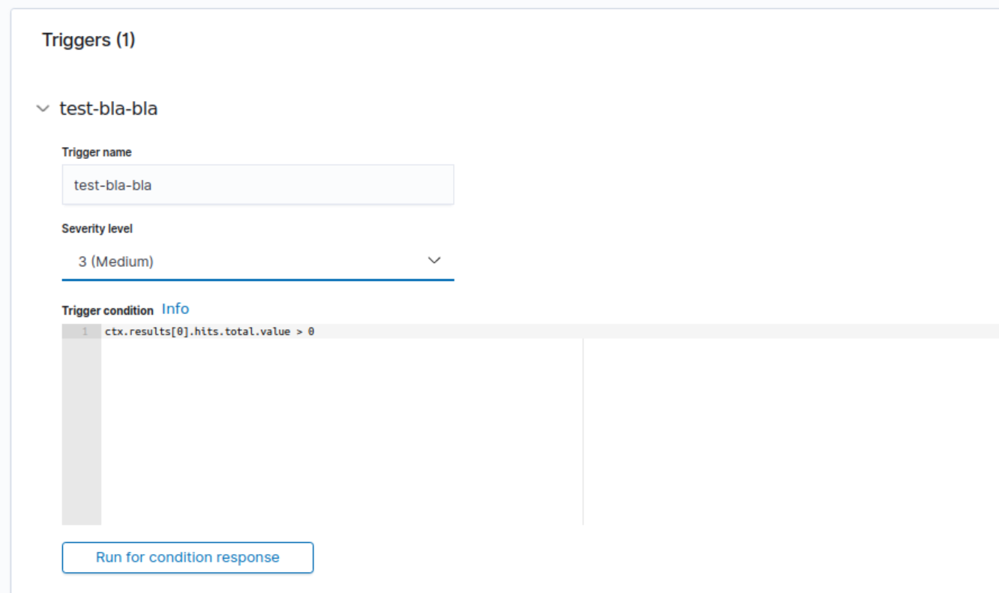
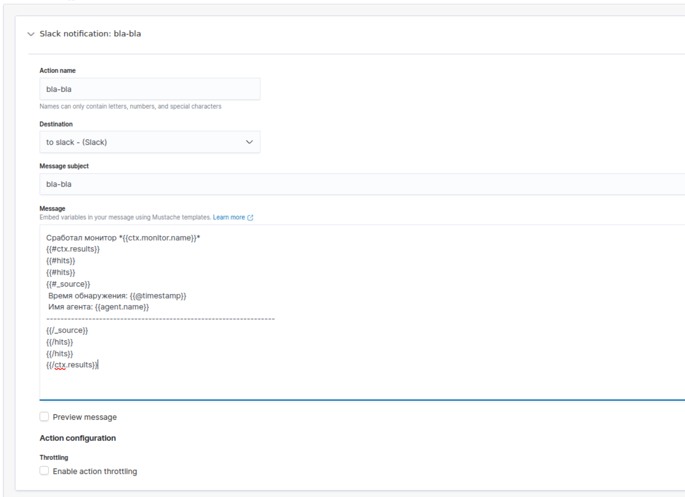

# EXAMPLE How to use Opensearch plugin alerting
| :bangbang: Important|
| :--- |

Before you go, you need create Destination for alerts:

[Opensearch destinations](https://opensearch.org/docs/latest/monitoring-plugins/alerting/monitors/#create-destinations)

[Opensearch docs](https://opensearch.org/docs/latest)

## Create monitor

### Monitor details

<div id="Monitor details">
 
<div>

### Data source

<div id="Data source">
 
<div>

## Qurey
```
{
    "size": 10,
    "query": {
        "bool": {
            "filter": [
                {
                    "range": {
                        "@timestamp": {
                            "from": "{{period_end}}||-24h",
                            "to": "{{period_end}}",
                            "include_lower": true,
                            "include_upper": true,
                            "format": "epoch_millis",
                            "boost": 1
                        }
                    }
                },
                {
                    "match_phrase": {
                        "rule.description": {
                            "query": "Possible buffer overflow attempt.",
                            "slop": 0,
                            "zero_terms_query": "NONE",
                            "boost": 1
                        }
                    }
                }
            ],
            "adjust_pure_negative": true,
            "boost": 1
        }
    },
    "aggregations": {}
}
```
| :bangbang: Important|
| :--- |
> "size": 10 - buffer size for events

> from": "{{period_end}}||-24h" - must be equal frequency from Monitor details

> "rule.description": { "query": "Possible buffer overflow attempt.", 
```
Here you can use:

rule.description

or

rule.mitre.id

These keys are from events received from agents, and you can use it for alerts.
```

## Create trigger

### Trigger name
<div id="Trigger name">
 
<div>

### Actions
<div id="Actions">
 
<div>

### Message

I use arrays, it allows to get a more complete picture of the same type of events from different devices.
Here you can add another information like a {{full_log}} and etc.

```
Сработал монитор *{{ctx.monitor.name}}*
{{#ctx.results}} 
{{#hits}}
{{#hits}}
{{#_source}}
 Время обнаружения: {{@timestamp}}
 Имя агента: {{agent.name}}
-----------------------------------------------------------------
{{/_source}}
{{/hits}}
{{/hits}}
{{/ctx.results}}
```
